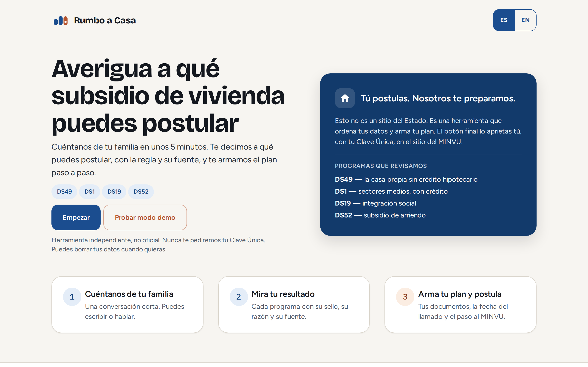
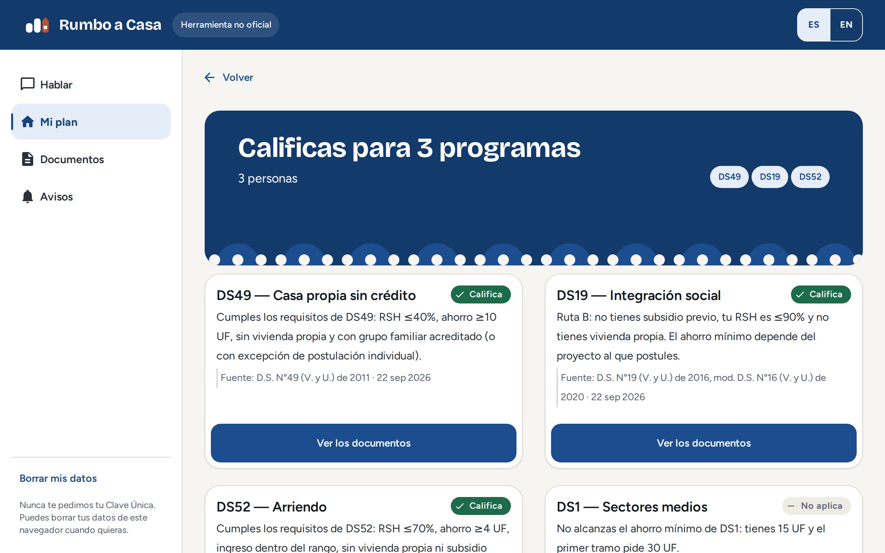
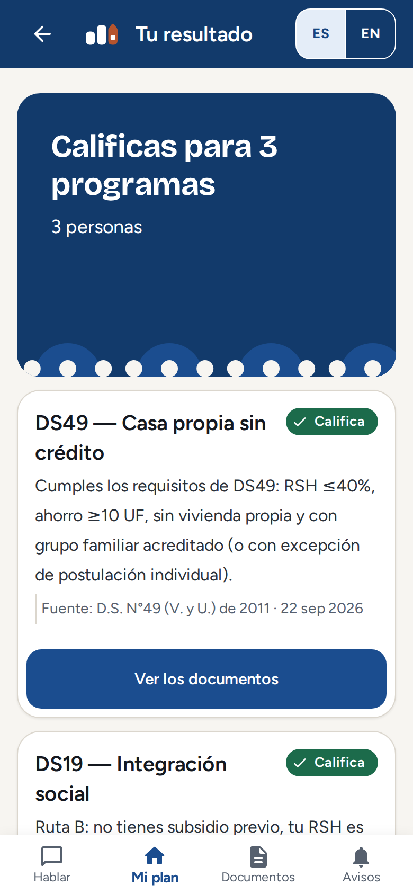

<p align="center">
  
</p>

<h1 align="center">Rumbo a Casa</h1>

<p align="center">
  <strong>Which housing subsidy fits your family, and the exact papers to bring.</strong><br />
  An assistant that guides Chilean families through four state housing subsidies, with a deterministic rules engine that cites the decree behind every answer.
</p>

<p align="center">
  <a href="https://d26duk07atmc3z.cloudfront.net"><strong>Live app</strong></a> ·
  <a href="https://d26duk07atmc3z.cloudfront.net">Try the demo mode</a> ·
  <a href="docs/evidence/README.md">Evidence of the coding agent on AWS</a>
</p>

<p align="center">
  
  
  
  
</p>

<p align="center">
  
</p>

> **AWS Zero to Shipped hackathon** · Category: Social Good · Track: Community

## The problem

In Chile, a family that wants to buy or rent a home with state help faces several programs (DS49, DS1, DS19, DS52), each with its own income bracket, savings threshold and paperwork. The rules live in decrees and call resolutions, and the application forms are long. Families often do not know which program they qualify for, or what to bring, until they are in front of a Serviu counter.

## What it does

1. **Interviews the family** in plain language, in Spanish or English, by typing or through a sample conversation.
2. **Decides eligibility for all four programs** with a rules engine. Each result shows a stamp (qualifies, does not apply, or data missing), the reason in one sentence, and the source: decree, call resolution and consultation date.
3. **Builds the plan**: the papers to bring for each program the family qualifies for, taken from the official application forms, plus a step-by-step path and reminders.
4. **Reads answers aloud** with Amazon Polly (Spanish and English voices).

<table>
  <tr>
    <td width="66%"></td>
    <td width="34%"></td>
  </tr>
</table>

## The design decision that matters

An LLM should not decide whether a family is entitled to a state benefit. So **the model talks and the code decides**:

- The rules live in a plain TypeScript **rules engine** ([`backend/src/rules-engine/`](backend/src/rules-engine)) with no AWS or model dependency, and a test enforces that it stays browser-safe. Every rule cites its source. Sources and figures are collected in [`docs/programas-subsidio.md`](docs/programas-subsidio.md).
- The model (Claude Haiku 4.5 on Amazon Bedrock, Converse API with tool use) only asks natural questions, understands messy answers and explains results. It fills a validated family profile through three tools (`actualizar_perfil`, `evaluar_elegibilidad`, `generar_plan`). Anything the Zod schema rejects is discarded and asked again.
- When data is missing, the engine says exactly which fields are missing (`falta_dato`) instead of guessing.
- The system prompt forbids announcing a verdict that was not returned by `evaluar_elegibilidad` in the same turn.
- The assistant never asks for a Clave Única, RUT, full name, address or bank details.

The same input always produces the same verdict, and the verdicts are covered by tests, including the edge cases (income at the limit, RSH bracket changes, unknown answers).

## Architecture

```
Browser ──► CloudFront ──┬─► S3 (single-page app)
                         └─► /api/*  ─► Lambda ─┬─► Amazon Bedrock (Claude Haiku 4.5, Converse API)
                                                ├─► Amazon Polly (text to speech)
                                                ├─► DynamoDB (session state only)
                                                └─► Rules engine + paper checklist (pure TypeScript)
```

| Service | Role |
|---|---|
| **Amazon CloudFront + S3** | Serve the single-page app and expose one public URL. A CloudFront Function rewrites SPA routes to `index.html`. |
| **AWS Lambda** | Function URL behind CloudFront at `/api/*`. Runs the chat loop, rules engine, paper checklist, voice and demo. |
| **Amazon Bedrock** | Claude Haiku 4.5 through a cross-region inference profile, with a shared time budget per message. |
| **Amazon Polly** | Generative voices (Lupe for Spanish, Ruth for English), capped at 1,500 characters per request. |
| **Amazon DynamoDB** | Session profile and chat history, kept for 30 days after the last message. The chat is free text: the assistant is instructed never to ask for RUT or Clave Única, but nothing filters what a person chooses to type. |
| **AWS CDK** | The whole stack as code, in `us-east-1`. |

### API

| Route | Purpose |
|---|---|
| `POST /api/chat` | One conversation turn. Body: session id, message and optional `idioma` (`es` or `en`). Clean `400`, `405`, `429`, `503` and `500` responses, localized. |
| `POST /api/voz` | Synthesizes speech for an assistant message. |
| `GET /api/demo` | A replayable conversation with a **fictional family**. The assistant lines are fixed, but every verdict and checklist is computed by the real rules engine. It needs no Bedrock or DynamoDB. |
| `GET /api/hello` | Health check. |

## Privacy

- No login and no CAPTCHA. The **demo mode** lets anyone see the full flow without entering personal data.
- Documents are never uploaded. The checklist is a reminder of what to bring; ticking a paper only marks it in your browser.
- The session (profile and chat history) is kept in DynamoDB for 30 days so that a conversation can continue. The "Delete my data" button clears the browser; the server copy expires by itself.
- The tool is independent and unofficial. It uses no MINVU or Serviu logos.

## Repository layout

```
backend/   Lambda handler, chat loop, rules engine, paper checklist, voice, demo and tests
infra/     CDK stack (CloudFront, S3, Lambda, DynamoDB, IAM) and its tests
web/       React + MUI single-page app (mobile-first, with a desktop layout), Spanish and English
docs/      Programs reference (sources cited by the rules engine) and evidence
```

## Run it

Requirements: Node.js and npm (developed on Node 24).

```bash
npm install
npm test                 # backend, infra and web suites; no AWS calls
npm run dev -w web       # web app on http://localhost:5173 (no backend behind /api)
```

The backend suite (362 tests) runs against fakes, the infra suite (10 tests) checks the synthesized stack, and the web suite (296 tests) covers components, screens and the desktop layout. `web/e2e/flujo-demo.mjs` drives the full flow in a real browser with Playwright.

## Deploy

```bash
AWS_PROFILE=<profile> npm run deploy -- RumboACasa   # builds the web app and runs `cdk deploy`
```

Bedrock needs model access enabled in the account, and the stack grants the Lambda `bedrock:InvokeModel`, DynamoDB read/write and `polly:SynthesizeSpeech`.

## Built with a coding agent connected to AWS

Development was done with Claude Code connected to the AWS account, through the official AWS MCP server and the AWS CLI. The agent read stack status and CloudWatch logs to diagnose failures, and its calls are recorded in CloudTrail. Redacted extracts and screenshots are in [`docs/evidence/`](docs/evidence/README.md), together with a log of live conversations against Bedrock.

## Limits

Rumbo a Casa is an orientation tool. It does not replace MINVU, Serviu or a social worker, and every result points to its official source. The last step, applying, is always done by the family on the official site.

- The DS52 figures are those of the Metropolitan Region call; outside it they may vary by region or commune, and the result says so.
- For the province of Palena and the regions of Aysén, Magallanes and Antártica, MINVU publishes no fixed DS49 housing-price cap and points to its own simulator instead.
- The language model can occasionally mix formal and informal address in Spanish. Verdicts are not affected, because they come from the rules engine.
